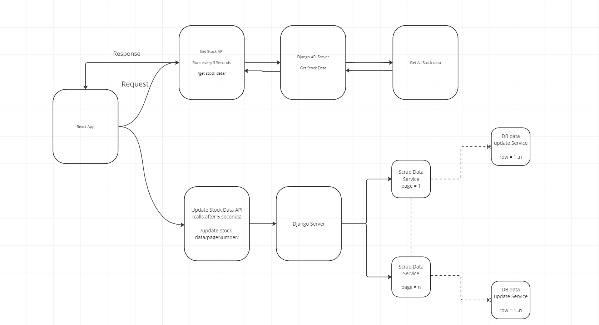
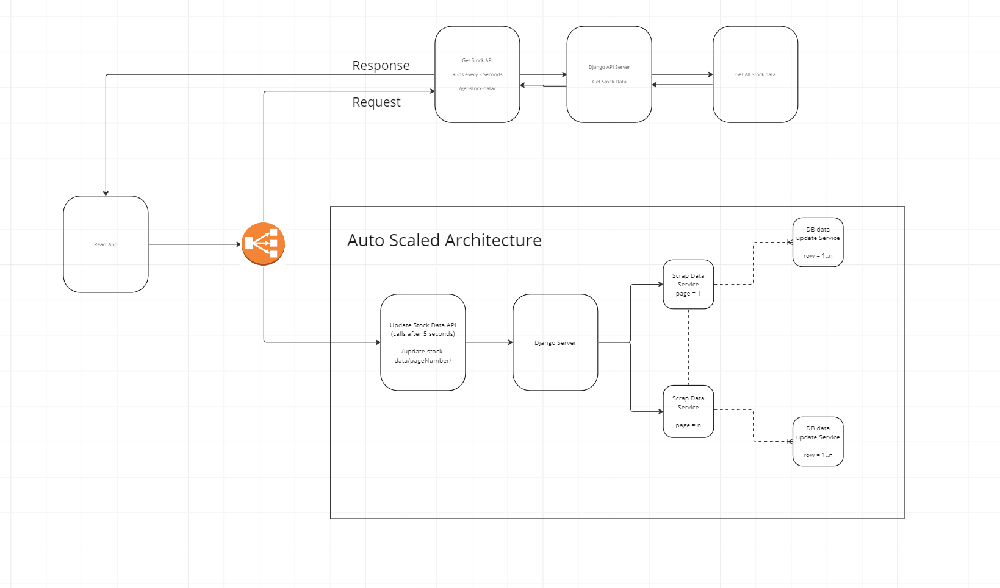

Set Up Project

### React Setup Process ###

git clone https://github.com/aviban12/my-react-app.git

cd my-react-app

npm install

npm start

Url = http://localhost:3000/

### Django Setup Process ###

git clone https://github.com/aviban12/Stock_market-data-platform.git

cd Stock_market-data-platform/backend/backendApp

pip install -r requirements.txt

python manage.py makemigrations

python manage.py migrate

python manage.py runserver

Url = http://localhost:8000/

### High Level Design ###

Current Flow without Any scaling

### Production Deployment Design ###

Auto Scaled Architecture
